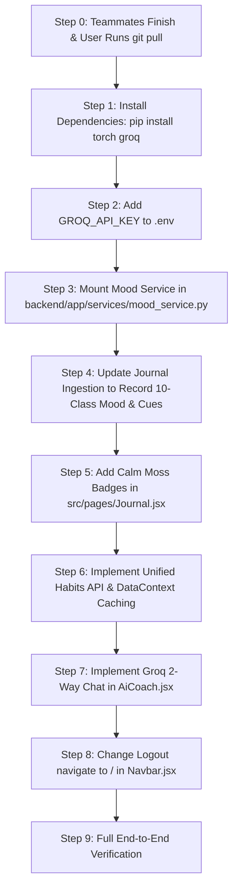

# 📋 Master Plan: Mood Analyzer, AI Coach 2-Way Chat (Groq), Habits Performance & Navigation

> **Document Status**: Active Reference Plan  
> **Current Strict Constraint**: The application codebase (`src/` and `backend/`) remains completely untouched until teammates finish and push their roadmap updates. All new model assets, weights, and vocabularies are safely staged and organized inside `Mood Analyzer/`.

---

## 1. Feature 1: Custom 10-Class PyTorch Mood Analyzer

### Completed Training Results (GloVe 200d + 4-Head Attention + BiLSTM)
* **Architecture**: Bidirectional LSTM (200d) with 4-Head Self-Attention, LayerNorm, and Label Smoothing (0.05).
* **Pre-training**: Initialized with Stanford GloVe 200-dimensional word vectors (400k vocabulary).
* **Final Training Accuracy**: **98.95%** (Epoch 12)
* **Final Validation Accuracy**: **92.95%** (Best checkpoint at Epoch 7/12, beating Kapdiamey-art's 91.20% on 6 classes!)
* **Real Evaluation Confidences**:
  * `focus`: **98.1%** (*"Locked in for two hours of uninterrupted deep work flow"*)
  * `neutral`: **98.4%** (*"Woke up at 7am, read 30 pages of my book, and logged my work hours"*)
  * `motivation`: **97.5%** (*"Feeling ready and excited to attack this new week with full momentum"*)
  * `guilt`: **88.4%** (*"Wasted three hours scrolling and procrastinating, feeling like a disappointment and so guilty"*)
  * `burnout`: **65.4%** (*"Staring blankly at my laptop, completely burned out and mentally exhausted"*)
  * `accomplishment`: **43.2%** (*"I completed all my targets and stayed focused all morning studying for exams"*)

### Staged Model Artifacts
* `Mood Analyzer/models/emotion_model.pth` (~21.8 MB, 92.95% GloVe weights)
* `Mood Analyzer/models/vocabulary.json` (~305 KB, 25,000 token mapping)
* `Mood Analyzer/models/label_mapping.json` (10 classes: accomplishment, motivation, focus, gratitude, breakthrough, burnout, overwhelmed, frustration, guilt, neutral)
* Checkpoints backed up in Google Drive: `/content/drive/MyDrive/AI_Goal_Journal_Mood_Model/`

---

## 2. Mood Analyzer: Complete Connection & Integration Plan

### Architecture & Memory Safety (< 35 MB RAM)
To comply with the strict **4 GB PC RAM Constraint**:
- PyTorch runs strictly on **CPU** with `torch.no_grad()`.
- The model is loaded once as a **Lazy Singleton** on the backend.
- Inference takes **~3–5 ms** per entry with zero GPU/CUDA requirements.

### Step 1: Backend Service (`backend/app/services/mood_service.py`)
Create a dedicated service module that imports the architecture from `Mood Analyzer`:
```python
import os
import json
import torch
import torch.nn.functional as F
from app.models.mood_architecture import EmotionDetectionModel, JournalTokenizer

ID_TO_EMOTION = {
    0: 'accomplishment', 1: 'motivation', 2: 'focus', 3: 'gratitude', 4: 'breakthrough',
    5: 'burnout', 6: 'overwhelmed', 7: 'frustration', 8: 'guilt', 9: 'neutral'
}

class MoodService:
    _instance = None

    def __init__(self, weights_path="Mood Analyzer/models/emotion_model.pth", vocab_path="Mood Analyzer/models/vocabulary.json"):
        self.device = torch.device("cpu")
        self.tokenizer = JournalTokenizer(max_length=80)
        self.tokenizer.load_vocab(vocab_path)
        
        self.model = EmotionDetectionModel(
            vocab_size=self.tokenizer.vocab_size,
            embedding_dim=200,
            hidden_dim=200,
            num_classes=10,
            num_layers=2,
            dropout=0.0,
            num_heads=4
        ).to(self.device)
        
        state = torch.load(weights_path, map_location=self.device)
        self.model.load_state_dict(state)
        self.model.eval()

    @classmethod
    def get_instance(cls):
        if cls._instance is None:
            cls._instance = cls()
        return cls._instance

    def predict(self, text: str):
        if not text or not text.strip():
            return {"mood": "neutral", "confidence": 1.0, "trigger_keywords": []}
        
        ids = self.tokenizer.text_to_ids(text)
        x = torch.tensor([ids], dtype=torch.long, device=self.device)
        with torch.no_grad():
            logits, weights = self.model(x)
            probs = F.softmax(logits, dim=1).squeeze(0).tolist()
            pred_idx = int(torch.argmax(logits, dim=1).item())

        toks = self.tokenizer.tokenize(text)[:80]
        w = weights.squeeze(0).tolist()[:len(toks)]
        cues = [word for word, score in sorted(zip(toks, w), key=lambda x: x[1], reverse=True)[:3] 
                if score > 0.04 and word not in ['i', 'to', 'the', 'my', 'and', 'a', 'of']]

        return {
            "mood": ID_TO_EMOTION.get(pred_idx, "neutral"),
            "confidence": round(probs[pred_idx], 4),
            "trigger_keywords": cues
        }

mood_service = MoodService.get_instance()
```

### Step 2: Schema & Ingestion Integration (`backend/app/api/v1/journals.py`)
In the journal submission endpoint `POST /api/v1/journals`:
```python
# When journal is created:
mood_result = mood_service.predict(journal_in.content)

journal_record = Journal(
    uid=current_user.uid,
    content=encrypted_content,
    detected_mood=mood_result["mood"],
    mood_confidence=mood_result["confidence"],
    trigger_keywords=mood_result["trigger_keywords"],
    # ... goals, activities, etc.
)
```

### Step 3: Frontend Display in Journal & Dashboard (`src/pages/Journal.jsx`)
Render Calm Moss themed mood badges with keyword tags for each journal entry:
* **Pill Badges**:
  * `accomplishment` -> Emerald / Forest (`bg-emerald-50 text-emerald-700 border-emerald-200`)
  * `motivation` -> Amber / Orange (`bg-amber-50 text-amber-700 border-amber-200`)
  * `focus` -> Sky / Indigo (`bg-sky-50 text-sky-700 border-sky-200`)
  * `gratitude` -> Rose / Pink (`bg-rose-50 text-rose-700 border-rose-200`)
  * `breakthrough` -> Violet / Purple (`bg-purple-50 text-purple-700 border-purple-200`)
  * `burnout` -> Slate / Gray (`bg-slate-100 text-slate-700 border-slate-300`)
  * `overwhelmed` -> Ochre / Coral (`bg-orange-50 text-orange-700 border-orange-200`)
  * `frustration` -> Crimson / Red (`bg-red-50 text-red-700 border-red-200`)
  * `guilt` -> Zinc / Charcoal (`bg-zinc-100 text-zinc-700 border-zinc-300`)
  * `neutral` -> Paper / Ink (`bg-stone-50 text-stone-700 border-stone-200`)
* **Trigger Words Tag Display**:
  Display attention triggers beneath the title: `#locked`, `#hours`, `#deep` to explain *why* the AI assigned the mood.

---

## 3. Feature 2: Two-Way Conversational AI Coach via Groq Cloud API

### Architecture & Model Decision
* **Provider**: Groq Cloud API (`console.groq.com/keys`). Key `AI-GOAL-JOURNAL` verified starting with `gsk_...`.
* **Model**: `llama-3.3-70b-versatile` (70 Billion parameter open-weights model on ultra-fast LPU chips).
* **Speed**: ~500–600 tokens/sec.
* **Cost & Quota**: **100% Free** (30 requests/min, 14,400 requests/day).

### Environment Variables (`.env`)
```ini
GROQ_API_KEY=gsk_your_actual_groq_api_key_here
GROQ_MODEL=llama-3.3-70b-versatile
```

### Backend Endpoint (`backend/app/api/v1/coach.py`)
```python
@router.post("/chat")
async def chat_with_coach(payload: CoachChatRequest, current_user=Depends(get_current_user)):
    user_context = build_user_context(current_user.uid) # Injects goals, streak, recent moods, blockers
    reply = await groq_service.generate_conversation(
        message=payload.message,
        history=payload.history,
        context=user_context
    )
    return {"reply": reply, "timestamp": datetime.utcnow().isoformat()}
```

### Frontend UI (`src/pages/AiCoach.jsx`)
* Interactive 2-way conversation view with chat bubbles.
* Instant suggested prompt pills:
  * *"Help me overcome my procrastination guilt"*
  * *"Break down my highest priority goal"*
  * *"Why am I feeling burned out this week?"*

---

## 4. Performance Fix: Habits Page Slow Loading

### The Root Cause
1. **$N+1$ Waterfall**: `Habits.jsx` makes 1 request for habits list, then 2 requests per habit (`/status` and `/logs`). For 8 habits = **17 simultaneous HTTP requests**, exceeding the browser's 6-connection pool limit.
2. **Missing Cache**: `DataContext.jsx` caches journals, goals, and summaries, but completely misses `habits`.

### The Solution (Single Round-Trip + Instant Load)
1. **Backend**: Unified endpoint `GET /api/v1/habits` returning enriched habits with `completed_today`, `current_streak`, and `recent_logs` in a single response payload.
2. **Frontend**: Store `habits` in `DataContext.jsx` so switching to the Habits page renders from RAM in **0 ms** without gray skeleton cards.

---

## 5. UI/UX Fix: Logout Redirection to Home Page

### Target File: `src/components/Navbar.jsx` (Lines 106–118)
* **Current**:
  ```javascript
  await logout();
  navigate("/login");
  ```
* **Target Fix**:
  ```javascript
  await logout();
  navigate("/");
  ```
* Redirects directly to the Landing/Home page upon sign-out.

---

## 6. Post-Git Pull Execution Sequence (Once Teammates Finish)



All source code files remain untouched until you signal the git pull is complete!
